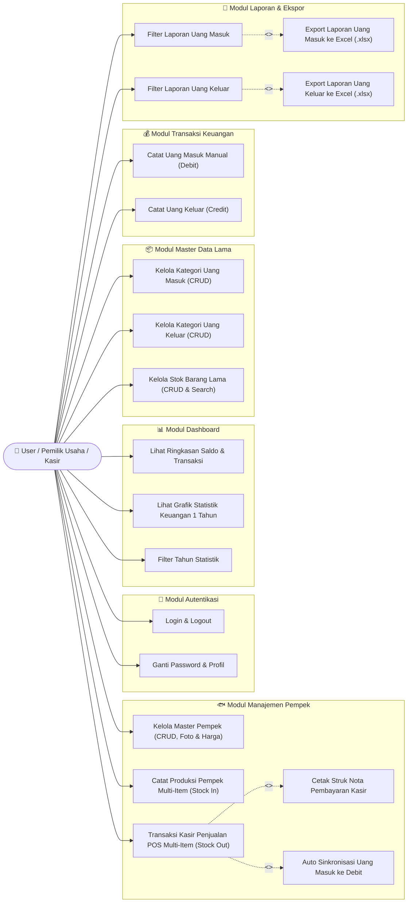
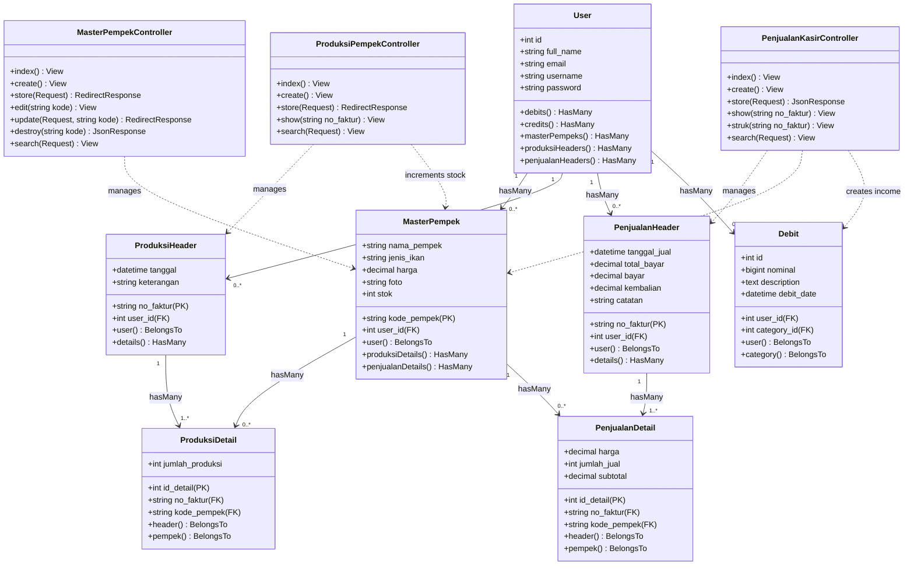
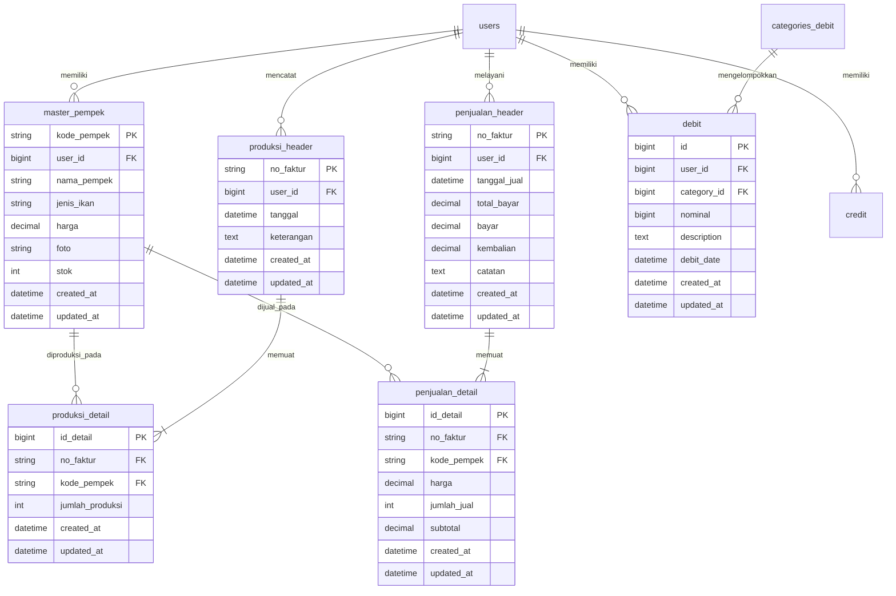
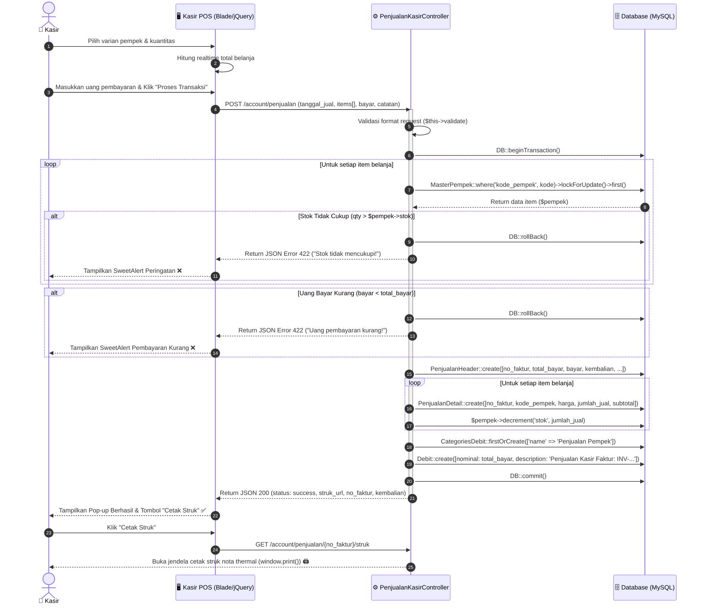
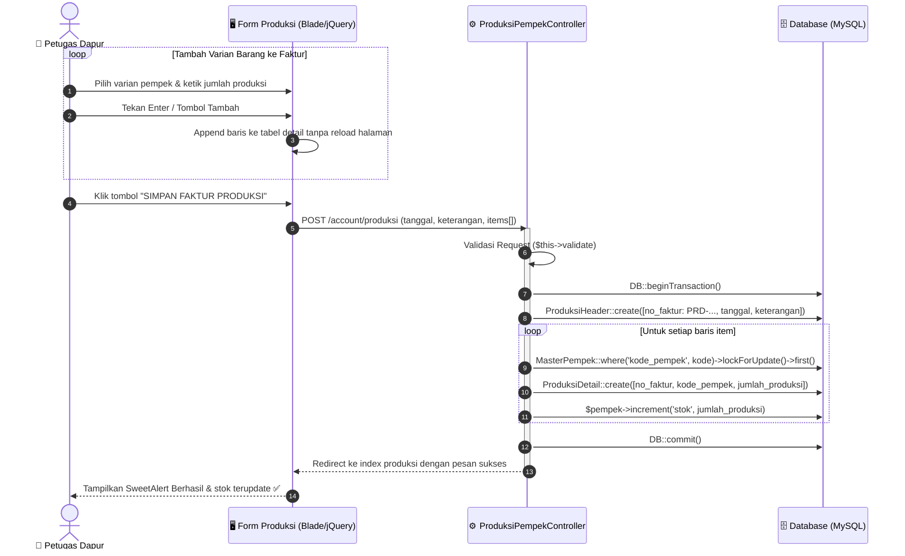
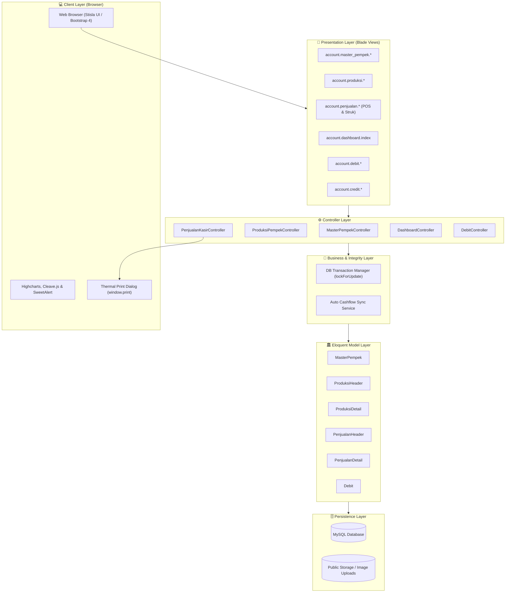

# Dokumentasi Diagram UML - Sistem Manajemen Usaha & Kasir Pempek

Dokumen ini memuat diagram UML lengkap untuk proyek **Manajemen Usaha & Kasir Pempek** yang dibuat menggunakan format Markdown Mermaid, mencakup fitur inventaris pempek multi-item dan kasir POS sesuai revisi dosen.

---

## 1. Use Case Diagram
Diagram ini memetakan peran pengguna (User / Pemilik Usaha / Kasir) serta fitur-fitur yang tersedia di dalam aplikasi.

---

## 2. Class Diagram
Diagram struktur kelas (Model Eloquent, Controller, Export) beserta relasinya.

---

## 3. Entity Relationship Diagram (ERD)
Diagram relasi basis data fisik dari database MySQL aplikasi manajemen usaha pempek.

---

## 4. Sequence Diagram: Transaksi Kasir POS & Pemotongan Stok Atomik
Diagram ini menunjukkan interaksi checkout kasir pempek dengan pengecekan stok server-side, mutasi stok atomik, pencatatan otomatis ke Uang Masuk (`debit`), dan cetak struk nota.

---

## 5. Sequence Diagram: Transaksi Produksi Multi-Item (Stock In)
Diagram alur pencatatan produksi dapur dengan mekanisme *append row* dan penambahan stok.

---

## 6. Component Diagram (Arsitektur Sistem)

