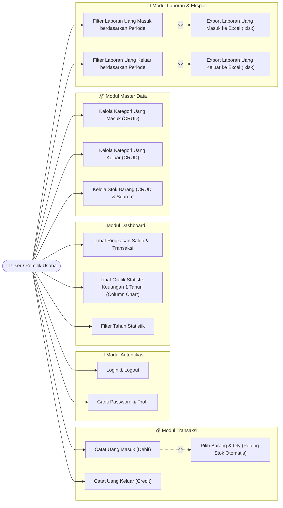
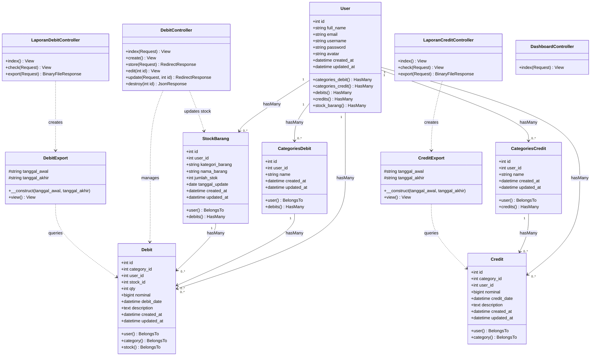
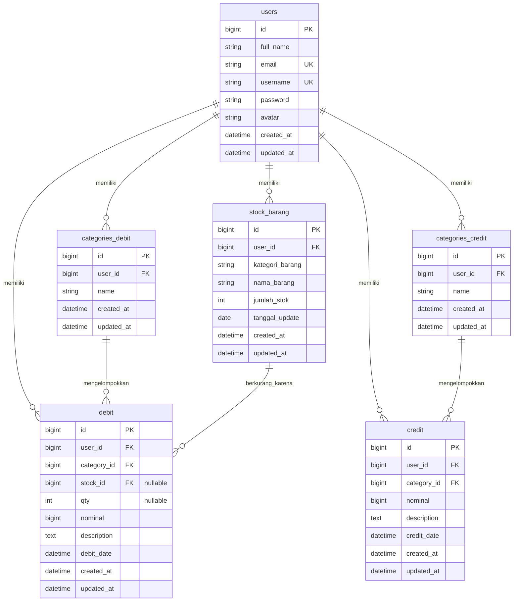
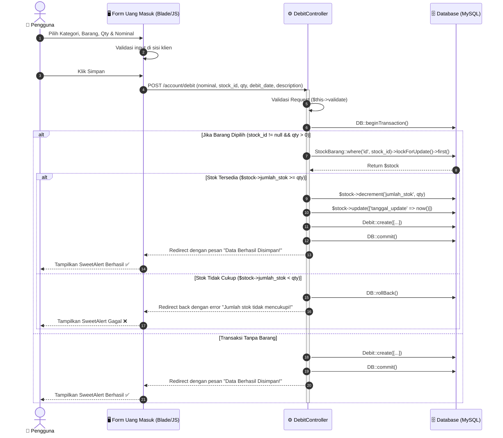
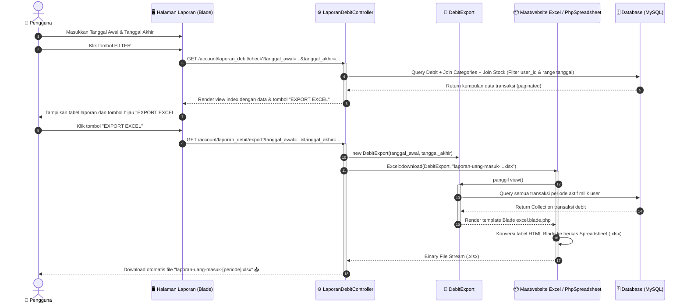
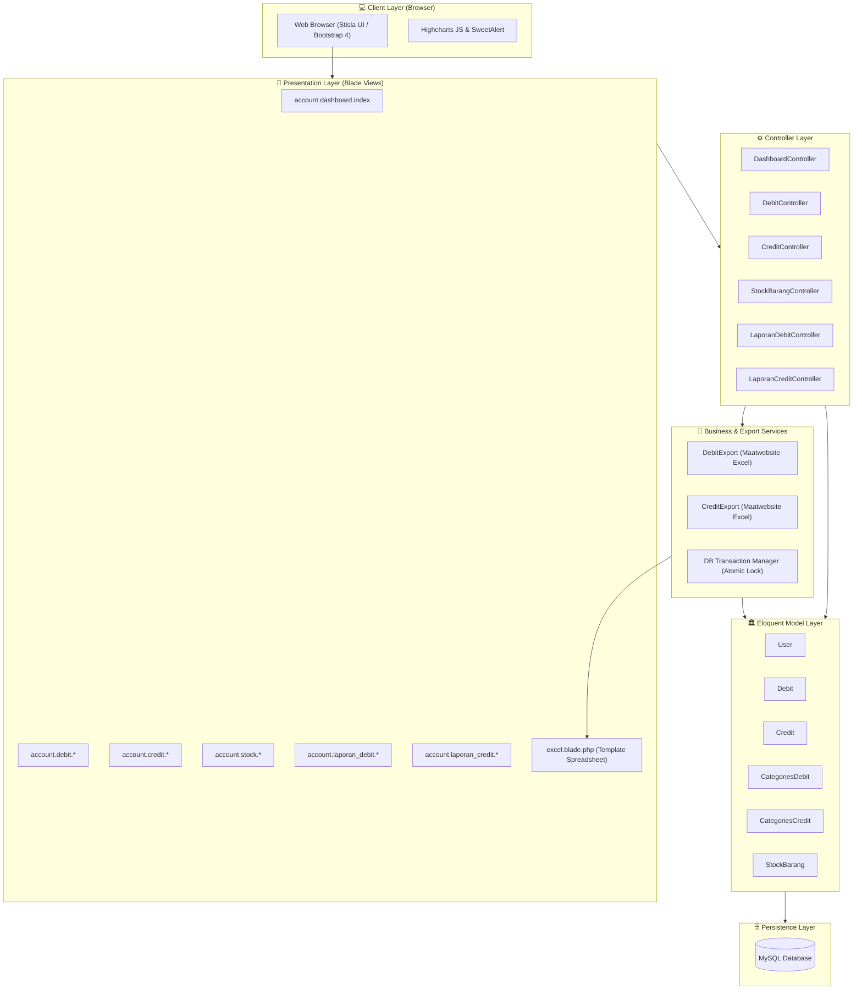

# Dokumentasi Diagram UML - Sistem Manajemen Usaha

Dokumen ini memuat diagram UML lengkap untuk proyek **Manajemen Usaha** yang dibuat menggunakan format Markdown Mermaid.

---

## 1. Use Case Diagram
Diagram ini memetakan peran pengguna (User / Pemilik Usaha) serta fitur-fitur yang tersedia di dalam aplikasi.

---

## 2. Class Diagram (Arsitektur Model, Controller & Export)
Diagram ini menggambarkan struktur kelas Domain Model Eloquent, Controller, dan Export Handler beserta atribut serta metodenya.

---

## 3. Entity Relationship Diagram (ERD)
Diagram relasi basis data fisik dari database MySQL aplikasi manajemen usaha.

---

## 4. Sequence Diagram: Transaksi Uang Masuk & Pemotongan Stok
Diagram ini menunjukkan interaksi sistem saat pengguna mencatat transaksi uang masuk dengan pengurangan stok barang yang dilindungi transaksi database ACID.

---

## 5. Sequence Diagram: Filter Laporan & Export ke Excel (.xlsx)
Diagram interaksi saat pengguna memfilter laporan keuangan dan mengunduh berkas spreadsheet Excel.

---

## 6. Component Diagram (Arsitektur Sistem)
Diagram ini memperlihatkan pemisahan lapisan arsitektur aplikasi (MVC Laravel, Presentation, Service/Export, dan Database).

